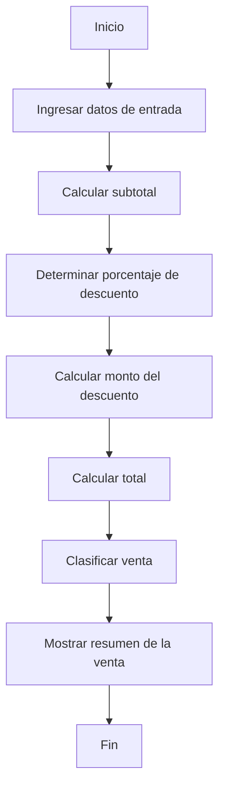

# Algoritmo de Procesamiento de Venta

## 1. Nombre del Algoritmo

Procesamiento de una Venta.

## 2. Objetivo

Procesar los datos de una venta para calcular el subtotal, determinar el
descuento correspondiente, calcular el total y clasificar la venta en su
respectiva categoría.

## 3. Datos de Entrada

* Nombre del cliente (`String`)
* Nombre del producto (`String`)
* Precio del producto (`double`)
* Cantidad de productos (`int`)

---

## 4. Procesamiento

### Paso 1: Solicitud de Datos

* **1.1.** Solicitar e ingresar el nombre del cliente.
* **1.2.** Solicitar e ingresar el nombre del producto.
* **1.3.** Solicitar e ingresar el precio del producto.
* **1.4.** Solicitar e ingresar la cantidad de productos.

### Paso 2: Cálculo del Subtotal

Calcular el subtotal multiplicando el precio por la cantidad:

$$
\text{subtotal} = \text{precio} \times \text{cantidad}
$$

### Paso 3: Determinación del Porcentaje de Descuento

Evaluar el valor del subtotal para asignar el porcentaje de descuento
correspondiente:

* Si $\text{subtotal} < 100 \rightarrow \text{porcentajeDescuento} = 0\%$
* Si $100 \le \text{subtotal} < 300 \rightarrow \text{porcentajeDescuento} = 5\%$
* Si $300 \le \text{subtotal} < 500 \rightarrow \text{porcentajeDescuento} = 10\%$
* Si $\text{subtotal} \ge 500 \rightarrow \text{porcentajeDescuento} = 15\%$

### Paso 4: Cálculo del Monto de Descuento

Calcular el monto monetario que se descuenta:

$$
\text{montoDescuento} =
\text{subtotal} \times \text{porcentajeDescuento}
$$

> En la implementación Java, los porcentajes se representan como valores
> decimales: `0.05`, `0.10` y `0.15`.

### Paso 5: Cálculo del Total

Calcular el monto final a pagar restando el descuento al subtotal:

$$
\text{total} =
\text{subtotal} - \text{montoDescuento}
$$

### Paso 6: Clasificación de la Venta

Clasificar la venta según el monto total obtenido:

* Si $\text{total} < 100 \rightarrow \text{categoria} =
  \text{"Venta pequeña"}$
* Si $100 \le \text{total} < 500 \rightarrow \text{categoria} =
  \text{"Venta mediana"}$
* Si $\text{total} \ge 500 \rightarrow \text{categoria} =
  \text{"Venta grande"}$

---

## 5. Datos de Salida (Resumen de la Venta)

El sistema mostrará en pantalla los siguientes resultados:

* Nombre del cliente
* Nombre del producto
* Precio unitario
* Cantidad
* Subtotal
* Porcentaje de descuento
* Monto del descuento
* Total a pagar
* Categoría de la venta

---

## 6. Flujo General

