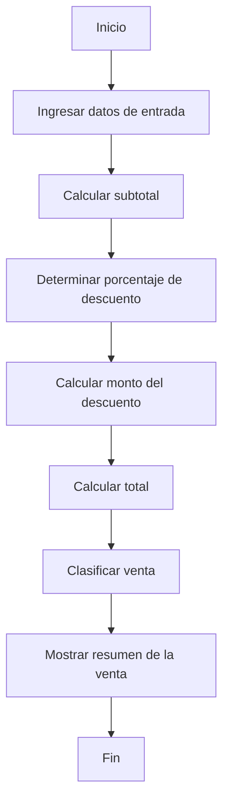

# Algoritmo de Procesamiento de Venta

## 1. Nombre del Algoritmo

Procesamiento de una Venta.

## 2. Objetivo

Procesar los datos de una venta para calcular el subtotal, determinar el
descuento correspondiente, calcular el total y clasificar la venta en su
respectiva categoría.

## 3. Datos de Entrada

* Nombre del cliente (`String`)
* Nombre del producto (`String`)
* Precio del producto (`double`)
* Cantidad de productos (`int`)

---

## Definición de Algoritmo

Un algoritmo es un conjunto de pasos ordenados y finitos que permiten
resolver un problema o realizar una tarea (Joyanes Aguilar, 2008). En este
proyecto, el algoritmo permite resolver el problema de calcular el total de
una venta aplicando un descuento y clasificándola según su monto.

Para construir este algoritmo se utilizaron variables, identificadores y
tipos de datos:

- **Variable:** es un espacio en memoria que almacena un valor que puede
  cambiar durante la ejecución del programa. En este proyecto se usan
  variables como `subtotal`, `total` y `porcentajeDescuento`.
- **Identificador:** es el nombre que se le da a una variable, método o
  clase (por ejemplo `nombreCliente`, `calcularSubtotal`, `Producto`). Deben
  ser claros y describir lo que representan.
- **Tipo de dato:** define qué clase de valor puede guardar una variable.
  En el proyecto se usan:
  - `String` para texto (nombre del cliente, nombre del producto).
  - `double` para números decimales (precio, subtotal, total).
  - `int` para números enteros (cantidad).

## Partes de un Algoritmo

Todo algoritmo se compone de tres partes: entrada, proceso y salida
(Joyanes Aguilar, 2008). En el algoritmo de procesamiento de venta estas
partes son:

- **Entrada:** los datos que ingresa el usuario — nombre del cliente,
  nombre del producto, precio y cantidad (ver sección 3).
- **Proceso:** los cálculos y decisiones que hace el sistema — calcular
  subtotal, determinar el descuento, calcular el total y clasificar la
  venta (ver sección 4).
- **Salida:** el resumen que se muestra en pantalla con todos los datos
  procesados de la venta (ver sección 5).

---

## 4. Procesamiento

### Paso 1: Solicitud de Datos

* **1.1.** Solicitar e ingresar el nombre del cliente.
* **1.2.** Solicitar e ingresar el nombre del producto.
* **1.3.** Solicitar e ingresar el precio del producto.
* **1.4.** Solicitar e ingresar la cantidad de productos.

### Paso 2: Cálculo del Subtotal

Calcular el subtotal multiplicando el precio por la cantidad:

$$
\text{subtotal} = \text{precio} \times \text{cantidad}
$$

### Paso 3: Determinación del Porcentaje de Descuento

Evaluar el valor del subtotal para asignar el porcentaje de descuento
correspondiente:

* Si $\text{subtotal} < 100 \rightarrow \text{porcentajeDescuento} = 0\%$
* Si $100 \le \text{subtotal} < 300 \rightarrow \text{porcentajeDescuento} = 5\%$
* Si $300 \le \text{subtotal} < 500 \rightarrow \text{porcentajeDescuento} = 10\%$
* Si $\text{subtotal} \ge 500 \rightarrow \text{porcentajeDescuento} = 15\%$

### Paso 4: Cálculo del Monto de Descuento

Calcular el monto monetario que se descuenta:

$$
\text{montoDescuento} =
\text{subtotal} \times \text{porcentajeDescuento}
$$

> En la implementación Java, los porcentajes se representan como valores
> decimales: `0.05`, `0.10` y `0.15`.

### Paso 5: Cálculo del Total

Calcular el monto final a pagar restando el descuento al subtotal:

$$
\text{total} =
\text{subtotal} - \text{montoDescuento}
$$

### Paso 6: Clasificación de la Venta

Clasificar la venta según el monto total obtenido:

* Si $\text{total} < 100 \rightarrow \text{categoria} =
  \text{"Venta pequeña"}$
* Si $100 \le \text{total} < 500 \rightarrow \text{categoria} =
  \text{"Venta mediana"}$
* Si $\text{total} \ge 500 \rightarrow \text{categoria} =
  \text{"Venta grande"}$

---

## 5. Datos de Salida (Resumen de la Venta)

El sistema mostrará en pantalla los siguientes resultados:

* Nombre del cliente
* Nombre del producto
* Precio unitario
* Cantidad
* Subtotal
* Porcentaje de descuento
* Monto del descuento
* Total a pagar
* Categoría de la venta

---

## 6. Flujo General

## Referencias bibliográficas

Joyanes Aguilar, L. (2008). *Fundamentos de programación: Algoritmos,
estructuras de datos y objetos* (4.ª ed.). McGraw-Hill.