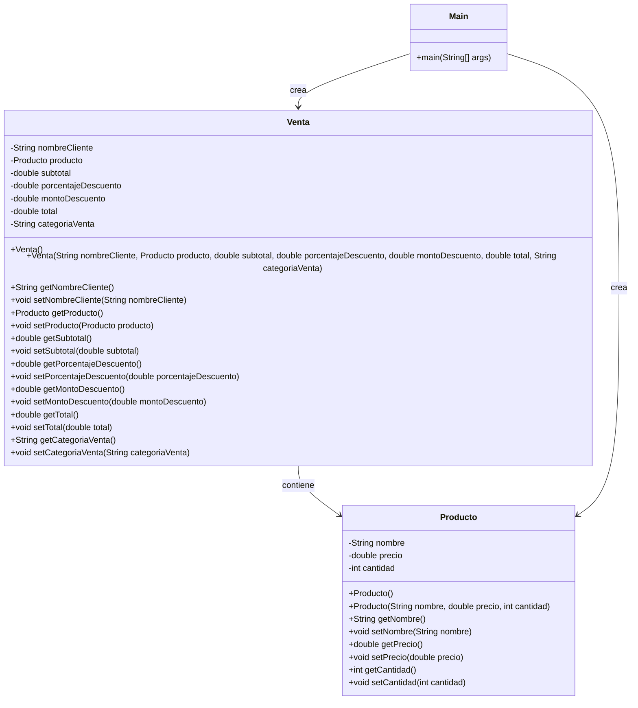

# Diagrama de Clases - Sistema de Gestión de Ventas

## 1. Objetivo

Representar la estructura de las clases utilizadas en el Sistema de Gestión
de Ventas, mostrando sus atributos, métodos y relaciones.

## 2. Clases del sistema

El proyecto AA1 está compuesto por tres clases principales:

- `Producto`
- `Venta`
- `Main`

## 3. Diagrama de Clases



## 4. Descripción de las clases

### Producto

La clase `Producto` representa el producto que participa en la venta.

Contiene:

- Nombre del producto.
- Precio unitario.
- Cantidad.

Los atributos son privados para aplicar el principio de encapsulamiento.

---

### Venta

La clase `Venta` representa la información relacionada con una operación
de venta.

Contiene:

- Nombre del cliente.
- Producto asociado.
- Subtotal.
- Porcentaje de descuento.
- Monto del descuento.
- Total.
- Categoría de la venta.

La clase utiliza un objeto `Producto` para representar el producto vendido.

---

### Main

La clase `Main` contiene el método `main`, que representa el punto de entrada
del programa.

Su función principal es ejecutar el sistema, solicitar los datos necesarios
y mostrar el resultado de la venta.

## 5. Relación entre las clases

La relación principal del sistema es:

```text
Main
 │
 ├── crea ──→ Producto
 │
 └── crea ──→ Venta
                 │
                 └── contiene ──→ Producto
```

## 6. Encapsulamiento

Los atributos de `Producto` y `Venta` se encuentran definidos como `private`.

El acceso a estos atributos se realiza mediante métodos `get` y `set`.

Ejemplo:

```java
private String nombre;
```

El atributo puede ser consultado mediante:

```java
getNombre()
```

y modificado mediante:

```java
setNombre()
```

Esto permite aplicar el concepto de **encapsulamiento de la Programación
Orientada a Objetos**.

## 7. Conclusión

El diagrama representa la estructura básica del Sistema de Gestión de Ventas
para la AA1 utilizando únicamente las clases implementadas en el proyecto:

```text
Producto.java
Venta.java
Main.java
```

No se utilizan clases adicionales en esta primera versión del proyecto.