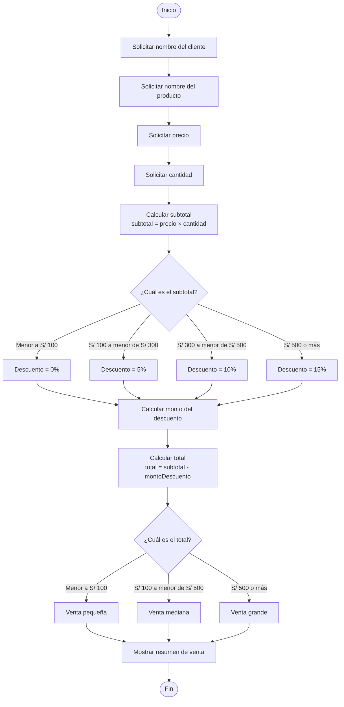

# Diagrama de Flujo - Sistema de Gestión de Ventas

## 1. Objetivo

Representar gráficamente el proceso que realiza el Sistema de Gestión de
Ventas desde el ingreso de los datos hasta la presentación del resultado.

## 2. Diagrama de Flujo



## 3. Flujo del proceso

El proceso se divide en las siguientes etapas:

1. **Entrada de datos:** se solicita la información del cliente y del
   producto.
2. **Procesamiento:** se calcula el subtotal.
3. **Condición de descuento:** se determina el porcentaje de descuento según
   el subtotal.
4. **Cálculo:** se obtiene el monto del descuento y el total.
5. **Clasificación:** se determina la categoría de la venta según el total.
6. **Salida:** se muestra el resumen de la venta.

## 4. Estructuras condicionales representadas

El diagrama representa dos decisiones principales:

### Descuento

```text
Subtotal < 100        → 0%
100 ≤ Subtotal < 300  → 5%
300 ≤ Subtotal < 500  → 10%
Subtotal ≥ 500        → 15%
```

### Categoría

```text
Total < 100        → Venta pequeña
100 ≤ Total < 500  → Venta mediana
Total ≥ 500        → Venta grande
```

## 5. Relación con el código Java

El flujo corresponde al funcionamiento de las clases:

```text
Producto.java
    ↓
Almacena nombre, precio y cantidad

Venta.java
    ↓
Calcula subtotal, descuento, total y categoría

Main.java
    ↓
Solicita datos y muestra resultados
```

## 6. Conclusión

El diagrama de flujo permite visualizar de manera gráfica la secuencia de
operaciones y las decisiones que forman parte del procesamiento de una venta.